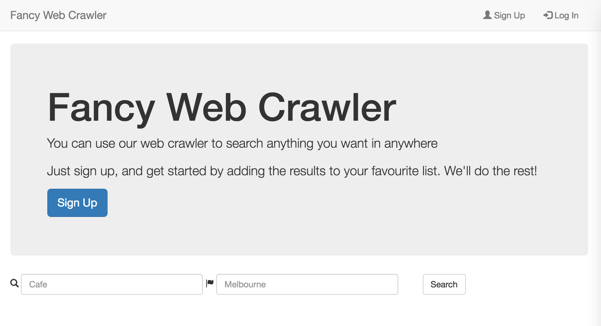
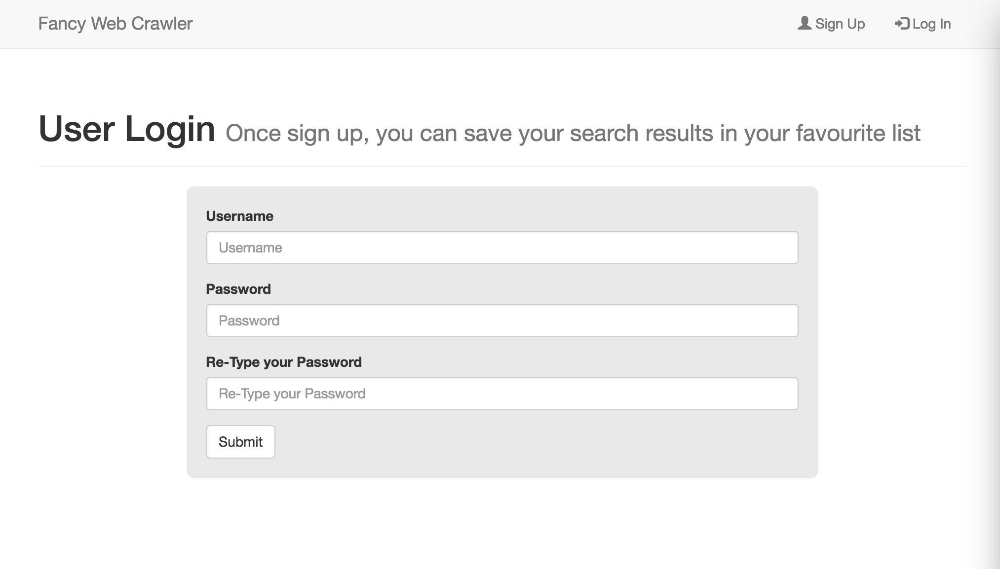
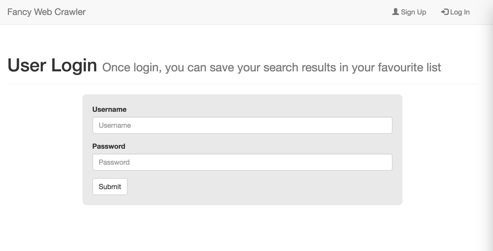
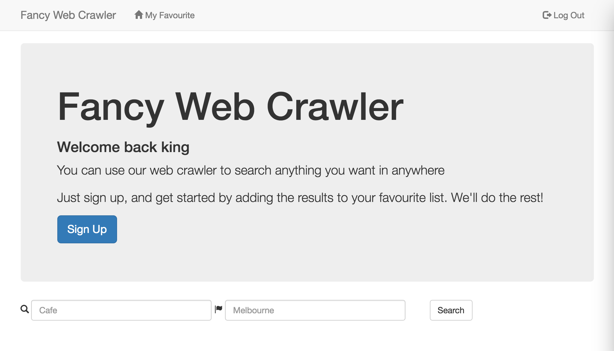
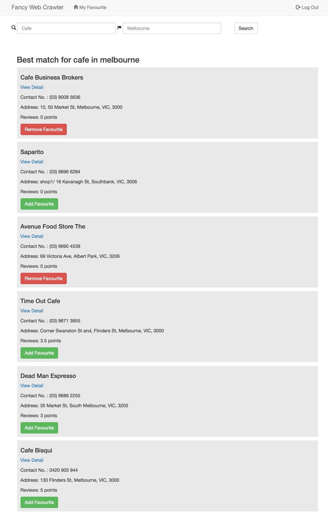
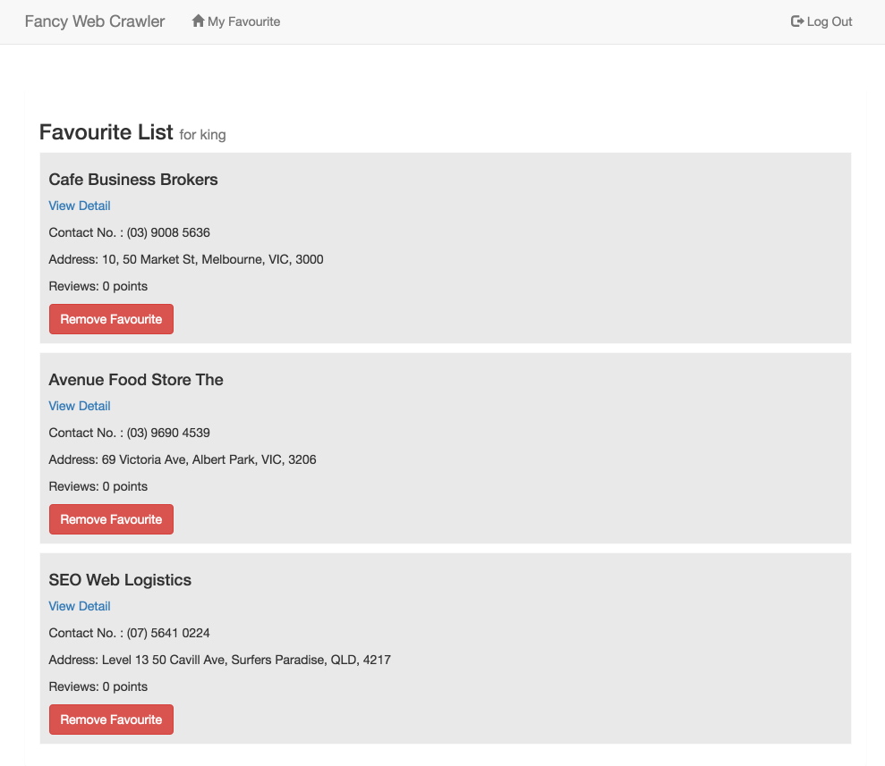

# Fancy Web Crawler

This is an application built to allow the user to search anything such as store, service in anywhere. But as those users who do not sign up, they just can search the breif results. On the another hand, once user register and login, they can get as much as information for their search and also can add results to their favourite lists.

It parses the store websites using `requests` and `BeautifulSoup`.

It allows users to register, log in, and search keywords and add, remove their results from their favourite lists.

Technology stack: MongoDB, Python (Flask & Jinja2), HTML/CSS/Bootstrap.

## Installation

1. Come to https://github.com/kingsleywang2013/web-crawler and choose branch 'run_local'.
2. Clone the repository (going to a terminal and run `git clone https://github.com/kingsleywang2013/web-crawler.git`.
3. Create a virtual environment for the repository (run `virtualenv --python=python3.5 venv`)
4. Run the Flask server by executing `venv/bin/python web-crawler/src/run.py`.

## Experience

The applicatin has also been deployed on Heroku cloud application platform. You can come to see the demo through the following url
https://fancy-web-crawler.herokuapp.com/

